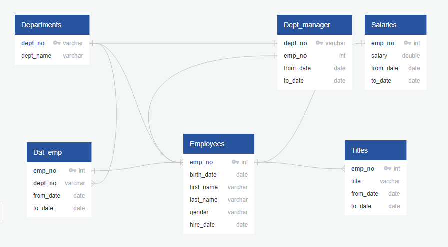
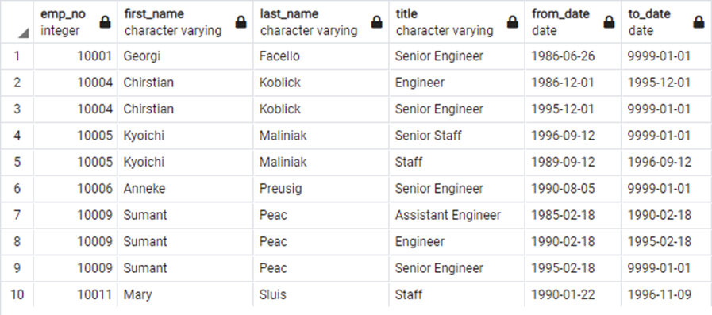
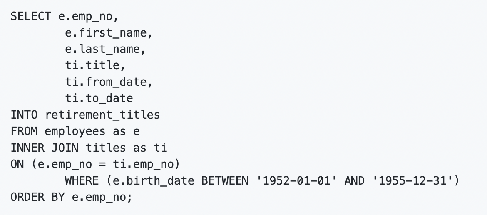
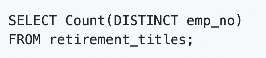
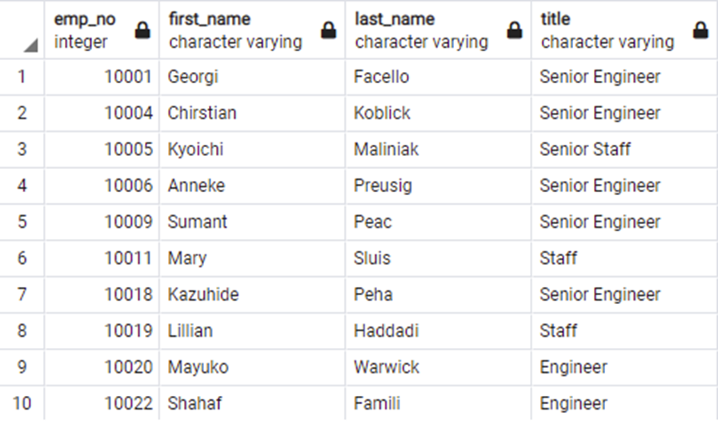
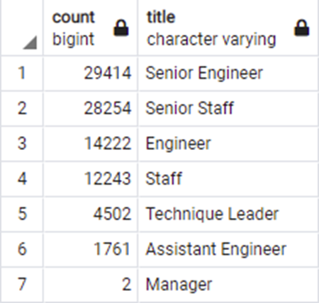
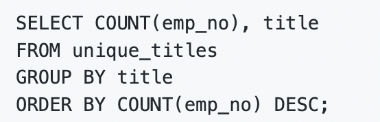
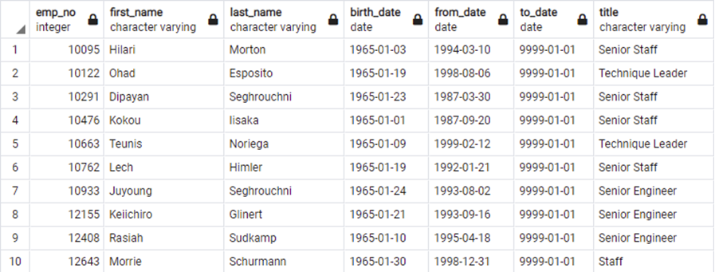
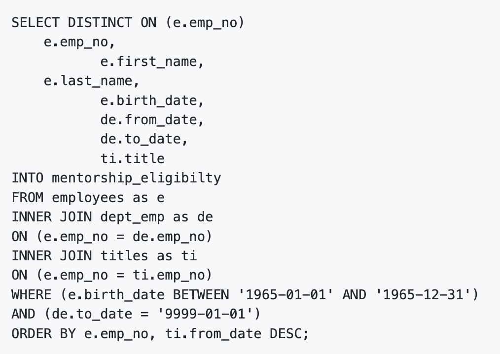
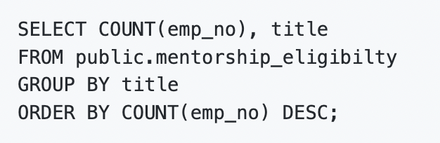

# Pewlett Hackard Analysis
 

## Overview

Pewlett-Packard is a large firm with many employees approaching retirement age, which will result in a significant number of job openings in the organization. The manager of Pewlett-Packard wants to be prepared for this development, known as the "Silver Tsunami" by designating some of the retirees as mentors to train the future generation of workers who would run Pewlett Hackard's operations and day-to-day activities.

The purpose of this study is to construct a list of employees approaching retirement age using Pewlett-Packard employee data. Employees born between January 1, 1952, and December 31, 1955 are included on the list. The company's management must be aware of the overall number of retirees, as well as the department in which they work and their title.

The database is built as picture shown below in the ERD, and then used as a base to demonstrate various SQL query:

## Results

The names of those born between 1952 and 1955 are presented in the table in the diagram below:

The number of entries in this table is calculated using `SELECT count(emp_no) FROM retirement_titles;`, which gives a total of 133776 lines.  Because the data comprises more than 130,000 lines, it requires additional filtration before it can be useful to PH management. Some entries are duplicated since some employees' titles have changed throughout their careers as they moved from one position to another.

Code used to create this table:

The picture below shows the table with the employees born between 1953 and 1955 but without the duplicates.  The number of entries in the table is 90398.  The query used to count them is:

Since 90398 is still a large number to make any decision, we need to refine the data even further:

The final filtering step is to present the data of the 90398 employees grouped by title. Below is the table with retiring titles:

This table is created using the following codes:

From the table, we know that about 30% of the employees of the company are about to retire. This is a challenge for Pewlett Hackard because the majority of the retirees are engineers with many years of experience. Even if the company manages to hire substitute engineers in a short amount of time, the new hires will require a lot of training before they can contribute effectively to the operations of Pewlett Hackard.

The total number of engineers in the table is 45397 (50%) of the retirees. The Senior Staff group is also another important part of the labor force that is retiring. There is a total of 28254 (31)% of the group. 

In order to deal with the challenge of retirement, the firm decides to select a group of employees born in 1965, which are 10 years younger than the retirees, and turn them into trainers for new hires and coworkers who will be promoted to fill future openings.

Below is the image showing the list of employees who fall under the indicated criteria:

The code used to generate the table is:

Using the code below, we obtain another table showing the number of potential trainers per title:

The total number of personnel that have been pre-selected for the post of trainer is 1549. We can get number of employees per trainer by devided this amount by the total number of employees departing, which is around 59 employees per trainer. The company can increase the efficiency of this training program by increasing the number of potential trainers.

## Summary

### - How many roles will need to be filled as the "silver tsunami" begins to make an impact?

As the "silver tsunami" begins to make an impact, 90398 employees will need to be replaced. Moreover, there are 45397 engineers in the company, accounting for 50.2% of all retirees. Another key segment of the labor force that is retirement of the Senior Staff, which is 28254, accounting for 31.3% of the total number.

### - Are there enough qualified, retirement-ready employees in the departments to mentor the next generation of Pewlett Hackard employees?

The total number of people who have been chosen for the job of trainer is 1549. There are 90398 people who are retiring.  We can get number of employees per trainer by devided this amount by the total number of employees departing, which is around 59 employees per trainer. Thus, the number of qualified and retirement-ready employees is not enough to mentor the next generation of Pewlett Hackard employees.

